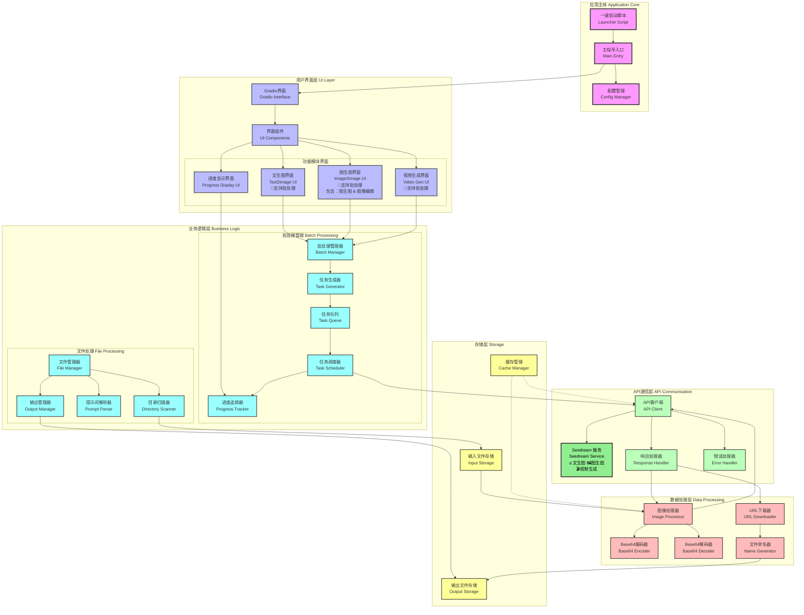

# 基于 Seedream API 图像批处理应用程序开发指南

## 0. 基本说明
本文档用于指导一个基于`Seedream`接口API的应用程序开发。此应用负责将本机图片，按照用户的需求批量提供给`Seedream`服务器，进行图像生成和编辑，并返回生成结果。

## 1. 基本功能
本应用要完成如下几个基本功能：
1. 实现与`Seedream`服务的API通信机制，使用API统一实现文生图、图生图、图像编辑、视频生成等任务；
2. 实现自动批处理功能（Batch Process），即用户可以指定对某个目录的所有图片进行批量编辑、或对某个文件中的所有图像生成提示词进行遍历，逐个生成图片而不需要人为干预；
3. 系统能够自动计算批处理任务数量、生成批处理任务、能够组合批处理任务、生成并管理批处理任务的队列、显示任务进度等；
4. 系统能够处理用户输入的图像，转换成 `base64` 格式发送，并能够将生成的图片，从输出URL位置取回，按照要求命名后放入用户指定的目录中；
5. 设计简洁明确的前端界面，方便用户使用！

## 2. 技术框架
- 采用最简的Gradio框架，一体化实现前后端代码
- 在项目基本开发任务完成后，提供一个一键启动脚本

## 3. 系统功能架构


## 4. API使用参考
这里列举几个典型工作场景中API使用方式，参考这些示例进行项目代码的编写。注意，这里所列的只是对于单个任务的API使用参考，来自官方网站的说明。批处理任务需要本项目自己生成和管理！

### 4.1 文生图
- 用途：用户输入一段描述文字，传递给`seedream`后，接收生成的图像，这个工作模式包括两种类型：
  - 文生单图：只生成单张图片
  - 文生组图：生成一个图像列表
  
- 用法：
  **首先是文生单图：**

  ```python
  import os
  from openai import OpenAI
  
  
  # 请确保您已将 API Key 存储在环境变量 ARK_API_KEY 中 
  # 初始化Ark客户端，从环境变量中读取您的API Key 
  client = OpenAI( 
      # 此为默认路径，您可根据业务所在地域进行配置 
      base_url="https://ark.cn-beijing.volces.com/api/v3", 
      # 从环境变量中获取您的 API Key。此为默认方式，您可根据需要进行修改 
      api_key=os.environ.get("ARK_API_KEY"), 
  ) 
   
  imagesResponse = client.images.generate( 
      model="doubao-seedream-4-0-250828", 
      prompt="星际穿越，黑洞，黑洞里冲出一辆快支离破碎的复古列车，抢视觉冲击力，电影大片，末日既视感，动感，对比色，oc渲染，光线追踪，动态模糊，景深，超现实主义，深蓝，画面通过细腻的  丰富的色彩层次塑造主体与场景，质感真实，暗黑风背景的光影效果营造出氛围，整体兼具艺术幻想感，夸张的广角透视效果，耀光，反射，极致的光影，强引力，吞噬",
      size="2K",
      response_format="url",
      extra_body={
          "watermark": True,
      },
  ) 
   
  print(imagesResponse.data[0].url)
  
  ```

  **文生组图：**
  ```python
  import os
  from openai import OpenAI
  
  
  # 请确保您已将 API Key 存储在环境变量 ARK_API_KEY 中 
  # 初始化Ark客户端，从环境变量中读取您的API Key 
  client = OpenAI( 
      # 此为默认路径，您可根据业务所在地域进行配置 
      base_url="https://ark.cn-beijing.volces.com/api/v3", 
      # 从环境变量中获取您的 API Key。此为默认方式，您可根据需要进行修改 
      api_key=os.environ.get("ARK_API_KEY"), 
  ) 
   
  imagesResponse = client.images.generate( 
      model="doubao-seedream-4-0-250828", 
      prompt="生成一组共4张连贯插画，核心为同一庭院一角的四季变迁，以统一风格展现四季独特色彩、元素与氛围",
      size="2K",
      response_format="url",
      extra_body={
          "watermark": True,
          "sequential_image_generation": "auto",
          "sequential_image_generation_options": {
              "max_images": 4
          },
      },
  ) 
   
  # 遍历所有图片数据
  for image in imagesResponse.data:
      # 输出当前图片的url和size
      print(f"URL: {image.url}, Size: {image.size}")
  
  ```

### 4.2 图生图
- 用途：用户输入一张或多张图片，传递给`seedream`后，结合用户的文本指令，生成图像并接收。这部分包括几种应用方式：
    - 图像编辑（多图融合）：用户输入一张或多张图片 + 对图像的编指令，生成结果图像
    - 组图输出：用户输入一张或多张图片，加上用户指文本，sh生成一系列相互关联或具有一致的一组图片，比如漫画分镜、品牌视觉等。
  
- 用法：
- 
  **对于“图像编辑”模式，即一张或多张图输入，单张图输出:**

  ```python
  import os
  from openai import OpenAI
  # 请确保您已将 API Key 存储在环境变量 ARK_API_KEY 中 
  # 初始化Ark客户端，从环境变量中读取您的API Key 
  client = OpenAI( 
      # 此为默认路径，您可根据业务所在地域进行配置 
      base_url="https://ark.cn-beijing.volces.com/api/v3", 
      # 从环境变量中获取您的 API Key。此为默认方式，您可根据需要进行修改 
      api_key=os.environ.get("ARK_API_KEY"), 
  ) 
   
  imagesResponse = client.images.generate( 
      model="doubao-seedream-4-0-250828", 
      prompt="将图1的服装换为图2的服装",
      size="2K",
      response_format="url",
      
      extra_body = {
          "image": ["https://ark-project.tos-cn-beijing.volces.com/doc_image/seedream4_imagesToimage_1.png", "https://ark-project.tos-cn-beijing.volces.com/doc_image/  seedream4_imagesToimage_2.png"],
          "watermark": True,
          "sequential_image_generation": "disabled",
      }
  ) 
   
  print(imagesResponse.data[0].url)
  ```

  **对于“组图输出”模式，即一张或多张参考图输入，多张图输出"**

  ```python
  import os
  from openai import OpenAI
  
  
  # 请确保您已将 API Key 存储在环境变量 ARK_API_KEY 中 
  # 初始化Ark客户端，从环境变量中读取您的API Key 
  client = OpenAI( 
      # 此为默认路径，您可根据业务所在地域进行配置 
      base_url="https://ark.cn-beijing.volces.com/api/v3", 
      # 从环境变量中获取您的 API Key。此为默认方式，您可根据需要进行修改 
      api_key=os.environ.get("ARK_API_KEY"), 
  ) 
   
  imagesResponse = client.images.generate( 
      model="doubao-seedream-4-0-250828", 
      prompt="生成3张女孩和奶牛玩偶在游乐园开心地坐过山车的图片，涵盖早晨、中午、晚上",
      size="2K",
      response_format="url",
      extra_body={
          "image": ["https://ark-project.tos-cn-beijing.volces.com/doc_image/seedream4_imagesToimages_1.png", "https://ark-project.tos-cn-beijing.volces.com/doc_image/  seedream4_imagesToimages_2.png"],
          "watermark": True,
          "sequential_image_generation": "auto",
          "sequential_image_generation_options": {
              "max_images": 3
          },
      }   
  ) 
   
  # 遍历所有图片数据
  for image in imagesResponse.data:
      # 输出当前图片的url和size
      print(f"URL: {image.url}, Size: {image.size}")

  ```

## 4 批处理功能

批处理是针对某个文件夹下的所有图片，做同样的批量处理操作！在这其中最重要的是，**如何组织批处理内容**！因此对于当前项目所规划的“文生图”和“图生图”两个标签页中，要为**单次任务**和**批处理任务**分别设计各自的功能区域（不要混在一起）！

我们针对前面提出的几种核心功能，分类描述如下：

## 4.1 文生图批处理设计

“文生图”分为“文生单图”和“文生组图”两种类型，虽然从 API 调用调用的方法中，仅仅相差一个参数`sequential_image_generation`和`sequential_image_generation_options`，但是在设计批处理时，需要进行区别设计！

1. 首先，在“文生图”标签页面，也要设置一个切换按钮，明确区分“文生单图”和“文生组图”两种模式，这个模式切换按钮控制所有“文生图”的任务模式，包括单次任务和批处理任务，因此要放在“文生图”标签页最顶部的显著位置，并设计清晰的说明文字来解释它的作用！
2. 在“文生单图”模式下，批处理任务的运行方式：读取提示词文件（txt, csv, xlsx）遍历每一行的提示词文本，顺序调用API去生成图像，在上一张生成的图像传回来之后，再继续送出下一个生成任务，以此类推完成批处理，并在这个过程中记录和显示生成进度，接收到的图像要根据其提示词顺序来编号，方便用户区分和归类；
3. 在“文生组图”模式下，批处理任务的运行方式：读取提示词文件（txt, csv, xlsx），文件上传区域要明确提示用户，在当前模式下，提示词内容必须要按照“组图生成”的方式进行撰写，否则无法达到预期效果，然后给出一个示例！后面的处理策略与“文生单图”模式下一样，遍历每一行的提示词，顺序调用API去生成组图，在这个过程中记录和显示生成进度，组图编号的命名需要**同时体现提示词的顺序和组内的相对顺序**，方便用户区分和归类。


## 5. 开发和调试要求
- 必须严格控制 API-KEY 的安全性，设计完整的机制保证不泄露用户API-KEY
- 使用Python虚拟环境来隔离环境
- 程序必须具备良好的兼容性、鲁棒性：
  - 对于“图像编辑”模式，需要处理输入/输出是单张图还是一组图片：当一组图片时，程序应该能够区分图片顺序，因为用户在指令词中会指定第几张图；
  - 对于“组图输出”模式，需要处理输入/输出是单张图还是一组图片：当一组图片时，程序应该能够区分图片顺序，因为用户在指令词中会指定第几张图；
- 保证应用结构的简单、清晰、容易维护
- 保持单个文件代码不超过600行