# 基于 Seedream API 图像批处理应用程序开发指南

## 0. 基本说明
本文档用于指导一个基于`Seedream`接口API的应用程序开发。此应用负责将本机图片，按照用户的需求批量提供给`Seedream`服务器，进行图像生成和编辑，并返回生成结果。

## 1. 基本功能
本应用要完成如下几个基本功能：
1. 实现与`Seedream`服务的API通信机制，使用API统一实现文生图、图生图、图像编辑、视频生成等任务；
2. 实现自动批处理功能（Batch Process），即用户可以指定对某个目录的所有图片进行批量编辑、或对某个文件中的所有图像生成提示词进行遍历，逐个生成图片而不需要人为干预；
3. 系统能够自动计算批处理任务数量、生成批处理任务、能够组合批处理任务、生成并管理批处理任务的队列、显示任务进度等；
4. 系统能够处理用户输入的图像，转换成 `base64` 格式发送，并能够将生成的图片，从输出URL位置取回，按照要求命名后放入用户指定的目录中；
5. 设计简洁明确的前端界面，方便用户使用！

## 2. 技术框架
- 采用最简的Gradio框架，一体化实现前后端代码
- 在项目基本开发任务完成后，提供一个一键启动脚本

## 3. 系统功能架构

```mermaid
graph TB
    %% 主应用层
    subgraph "应用主体 Application Core"
        MAIN[主程序入口<br/>Main Entry]
        CONFIG[配置管理<br/>Config Manager]
        LAUNCHER[一键启动脚本<br/>Launcher Script]
    end

    %% UI层
    subgraph "用户界面层 UI Layer"
        UI[Gradio界面<br/>Gradio Interface]
        UI_COMP[界面组件<br/>UI Components]
        
        subgraph "功能模块界面"
            UI_TEXT[文生图界面<br/>Text2Image UI<br/>📁支持批处理]
            UI_IMG[图生图界面<br/>Image2Image UI<br/>📁支持批处理<br/>包含：图生图 & 图像编辑]
            UI_VIDEO[视频生成界面<br/>Video Gen UI<br/>📁支持批处理]
            UI_PROGRESS[进度显示界面<br/>Progress Display UI]
        end
    end

    %% 业务逻辑层
    subgraph "业务逻辑层 Business Logic"
        subgraph "批处理管理 Batch Processing"
            BATCH_MGR[批处理管理器<br/>Batch Manager]
            TASK_GEN[任务生成器<br/>Task Generator]
            TASK_QUEUE[任务队列<br/>Task Queue]
            TASK_SCHEDULER[任务调度器<br/>Task Scheduler]
            PROGRESS_TRACKER[进度追踪器<br/>Progress Tracker]
        end
        
        subgraph "文件处理 File Processing"
            FILE_MGR[文件管理器<br/>File Manager]
            DIR_SCANNER[目录扫描器<br/>Directory Scanner]
            PROMPT_PARSER[提示词解析器<br/>Prompt Parser]
            OUTPUT_MGR[输出管理器<br/>Output Manager]
        end
    end

    %% API通信层 - 简化为统一的Seedream服务
    subgraph "API通信层 API Communication"
        SEEDREAM_API[Seedream 服务<br/>Seedream Service<br/>🔥文生图 🖼️图生图<br/>🎬视频生成]
        API_CLIENT[API客户端<br/>API Client]
        API_HANDLER[响应处理器<br/>Response Handler]
        ERROR_HANDLER[错误处理器<br/>Error Handler]
    end

    %% 数据处理层
    subgraph "数据处理层 Data Processing"
        IMG_PROCESSOR[图像处理器<br/>Image Processor]
        B64_ENCODER[Base64编码器<br/>Base64 Encoder]
        B64_DECODER[Base64解码器<br/>Base64 Decoder]
        URL_DOWNLOADER[URL下载器<br/>URL Downloader]
        NAME_GENERATOR[文件命名器<br/>Name Generator]
    end

    %% 存储层
    subgraph "存储层 Storage"
        INPUT_STORAGE[输入文件存储<br/>Input Storage]
        OUTPUT_STORAGE[输出文件存储<br/>Output Storage]
        CACHE[缓存管理<br/>Cache Manager]
    end

    %% 连接关系
    MAIN --> CONFIG
    MAIN --> UI
    LAUNCHER --> MAIN
    
    UI --> UI_COMP
    UI_COMP --> UI_TEXT
    UI_COMP --> UI_IMG
    UI_COMP --> UI_VIDEO
    UI_COMP --> UI_PROGRESS
    
    %% 各功能界面都连接到批处理管理器
    UI_TEXT --> BATCH_MGR
    UI_IMG --> BATCH_MGR
    UI_VIDEO --> BATCH_MGR
    
    UI_PROGRESS --> PROGRESS_TRACKER
    
    BATCH_MGR --> TASK_GEN
    TASK_GEN --> TASK_QUEUE
    TASK_QUEUE --> TASK_SCHEDULER
    TASK_SCHEDULER --> PROGRESS_TRACKER
    
    %% 任务调度器统一调用API客户端
    TASK_SCHEDULER --> API_CLIENT
    API_CLIENT --> SEEDREAM_API
    
    API_CLIENT --> API_HANDLER
    API_CLIENT --> ERROR_HANDLER
    
    FILE_MGR --> DIR_SCANNER
    FILE_MGR --> PROMPT_PARSER
    FILE_MGR --> OUTPUT_MGR
    
    DIR_SCANNER --> INPUT_STORAGE
    OUTPUT_MGR --> OUTPUT_STORAGE
    
    IMG_PROCESSOR --> B64_ENCODER
    IMG_PROCESSOR --> B64_DECODER
    API_HANDLER --> URL_DOWNLOADER
    URL_DOWNLOADER --> NAME_GENERATOR
    NAME_GENERATOR --> OUTPUT_STORAGE
    
    INPUT_STORAGE --> IMG_PROCESSOR
    IMG_PROCESSOR --> API_CLIENT
    API_HANDLER --> IMG_PROCESSOR
    
    CACHE -.-> API_CLIENT
    CACHE -.-> IMG_PROCESSOR

    %% 样式定义
    classDef mainStyle fill:#f9f,stroke:#333,stroke-width:3px
    classDef uiStyle fill:#bbf,stroke:#333,stroke-width:2px
    classDef apiStyle fill:#bfb,stroke:#333,stroke-width:2px
    classDef dataStyle fill:#fbb,stroke:#333,stroke-width:2px
    classDef storageStyle fill:#ff9,stroke:#333,stroke-width:2px
    classDef logicStyle fill:#9ff,stroke:#333,stroke-width:2px
    classDef seedreamStyle fill:#90EE90,stroke:#333,stroke-width:3px,color:#000
    
    class MAIN,CONFIG,LAUNCHER mainStyle
    class UI,UI_COMP,UI_TEXT,UI_IMG,UI_VIDEO,UI_PROGRESS uiStyle
    class API_CLIENT,API_HANDLER,ERROR_HANDLER apiStyle
    class SEEDREAM_API seedreamStyle
    class IMG_PROCESSOR,B64_ENCODER,B64_DECODER,URL_DOWNLOADER,NAME_GENERATOR dataStyle
    class INPUT_STORAGE,OUTPUT_STORAGE,CACHE storageStyle
    class BATCH_MGR,TASK_GEN,TASK_QUEUE,TASK_SCHEDULER,PROGRESS_TRACKER,FILE_MGR,DIR_SCANNER,PROMPT_PARSER,OUTPUT_MGR logicStyle
```


## 4. API使用参考
这里列举几个典型工作场景中API使用方式，参考这些示例进行项目代码的编写。注意，这里所列的只是对于单个任务的API使用参考，来自官方网站的说明。批处理任务需要本项目自己生成和管理！

### 4.1 文生图
- 用途：用户输入一段描述文字，传递给`seedream`后，接收生成的图像，这个工作模式包括两种类型：
  - 文生单图：只生成单张图片
  - 文生组图：生成一个图像列表
  
- 用法：
  **首先是文生单图：**

  ```python
  import os
  from openai import OpenAI
  
  
  # 请确保您已将 API Key 存储在环境变量 ARK_API_KEY 中 
  # 初始化Ark客户端，从环境变量中读取您的API Key 
  client = OpenAI( 
      # 此为默认路径，您可根据业务所在地域进行配置 
      base_url="https://ark.cn-beijing.volces.com/api/v3", 
      # 从环境变量中获取您的 API Key。此为默认方式，您可根据需要进行修改 
      api_key=os.environ.get("ARK_API_KEY"), 
  ) 
   
  imagesResponse = client.images.generate( 
      model="doubao-seedream-4-0-250828", 
      prompt="星际穿越，黑洞，黑洞里冲出一辆快支离破碎的复古列车，抢视觉冲击力，电影大片，末日既视感，动感，对比色，oc渲染，光线追踪，动态模糊，景深，超现实主义，深蓝，画面通过细腻的  丰富的色彩层次塑造主体与场景，质感真实，暗黑风背景的光影效果营造出氛围，整体兼具艺术幻想感，夸张的广角透视效果，耀光，反射，极致的光影，强引力，吞噬",
      size="2K",
      response_format="url",
      extra_body={
          "watermark": True,
      },
  ) 
   
  print(imagesResponse.data[0].url)
  
  ```

  **文生组图：**
  ```python
  import os
  from openai import OpenAI
  
  
  # 请确保您已将 API Key 存储在环境变量 ARK_API_KEY 中 
  # 初始化Ark客户端，从环境变量中读取您的API Key 
  client = OpenAI( 
      # 此为默认路径，您可根据业务所在地域进行配置 
      base_url="https://ark.cn-beijing.volces.com/api/v3", 
      # 从环境变量中获取您的 API Key。此为默认方式，您可根据需要进行修改 
      api_key=os.environ.get("ARK_API_KEY"), 
  ) 
   
  imagesResponse = client.images.generate( 
      model="doubao-seedream-4-0-250828", 
      prompt="生成一组共4张连贯插画，核心为同一庭院一角的四季变迁，以统一风格展现四季独特色彩、元素与氛围",
      size="2K",
      response_format="url",
      extra_body={
          "watermark": True,
          "sequential_image_generation": "auto",
          "sequential_image_generation_options": {
              "max_images": 4
          },
      },
  ) 
   
  # 遍历所有图片数据
  for image in imagesResponse.data:
      # 输出当前图片的url和size
      print(f"URL: {image.url}, Size: {image.size}")
  
  ```

### 4.2 图生图
- 用途：用户输入一张或多张图片，传递给`seedream`后，结合用户的文本指令，生成图像并接收。这部分包括几种应用方式：
    - 图像编辑（多图融合）：用户输入一张或多张图片 + 对图像的编指令，生成结果图像
    - 组图输出：用户输入一张或多张图片，加上用户指文本，sh生成一系列相互关联或具有一致的一组图片，比如漫画分镜、品牌视觉等。
  
- 用法：
- 
  **对于“图像编辑”模式，即一张或多张图输入，单张图输出:**

  ```python
  import os
  from openai import OpenAI
  # 请确保您已将 API Key 存储在环境变量 ARK_API_KEY 中 
  # 初始化Ark客户端，从环境变量中读取您的API Key 
  client = OpenAI( 
      # 此为默认路径，您可根据业务所在地域进行配置 
      base_url="https://ark.cn-beijing.volces.com/api/v3", 
      # 从环境变量中获取您的 API Key。此为默认方式，您可根据需要进行修改 
      api_key=os.environ.get("ARK_API_KEY"), 
  ) 
   
  imagesResponse = client.images.generate( 
      model="doubao-seedream-4-0-250828", 
      prompt="将图1的服装换为图2的服装",
      size="2K",
      response_format="url",
      
      extra_body = {
          "image": ["https://ark-project.tos-cn-beijing.volces.com/doc_image/seedream4_imagesToimage_1.png", "https://ark-project.tos-cn-beijing.volces.com/doc_image/  seedream4_imagesToimage_2.png"],
          "watermark": True,
          "sequential_image_generation": "disabled",
      }
  ) 
   
  print(imagesResponse.data[0].url)
  ```

  **对于“组图输出”模式，即一张或多张参考图输入，多张图输出"**

  ```python
  import os
  from openai import OpenAI
  
  
  # 请确保您已将 API Key 存储在环境变量 ARK_API_KEY 中 
  # 初始化Ark客户端，从环境变量中读取您的API Key 
  client = OpenAI( 
      # 此为默认路径，您可根据业务所在地域进行配置 
      base_url="https://ark.cn-beijing.volces.com/api/v3", 
      # 从环境变量中获取您的 API Key。此为默认方式，您可根据需要进行修改 
      api_key=os.environ.get("ARK_API_KEY"), 
  ) 
   
  imagesResponse = client.images.generate( 
      model="doubao-seedream-4-0-250828", 
      prompt="生成3张女孩和奶牛玩偶在游乐园开心地坐过山车的图片，涵盖早晨、中午、晚上",
      size="2K",
      response_format="url",
      extra_body={
          "image": ["https://ark-project.tos-cn-beijing.volces.com/doc_image/seedream4_imagesToimages_1.png", "https://ark-project.tos-cn-beijing.volces.com/doc_image/  seedream4_imagesToimages_2.png"],
          "watermark": True,
          "sequential_image_generation": "auto",
          "sequential_image_generation_options": {
              "max_images": 3
          },
      }   
  ) 
   
  # 遍历所有图片数据
  for image in imagesResponse.data:
      # 输出当前图片的url和size
      print(f"URL: {image.url}, Size: {image.size}")

  ```

## 4. 开发和调试要求
- 必须严格控制 API-KEY 的安全性，设计完整的机制保证不泄露用户API-KEY
- 程序必须具备良好的兼容性、鲁棒性：
  - 对于“图像编辑”模式，需要处理输入/输出是单张图还是一组图片：当一组图片时，程序应该能够区分图片顺序，因为用户在指令词中会指定第几张图；
  - 对于“组图输出”模式，需要处理输入/输出是单张图还是一组图片：当一组图片时，程序应该能够区分图片顺序，因为用户在指令词中会指定第几张图；